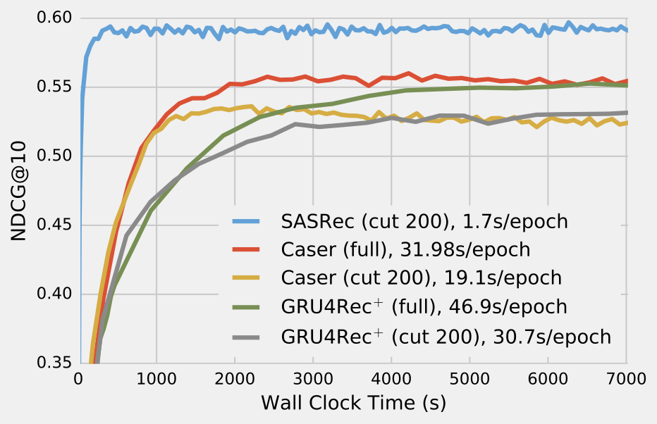

# SASRec: Self-Attentive Sequential Recommendation Replication 
Authors: Thomas Nguyen, Hughdan Liu

## What I've done so far
1. Verified code works and reproduced results of ml-1m.
2. Created a result postprocessing script to analyze the avg ndcg@10 and avg hit@10
3. reproduced results on a second dataset (46 hours... MacBook dead)
4. Increased Maxlen on the ML-1m to see how doubling the length of memory sequence in 
this time series problem affects long term accuracy. Increased dropout rate to 0.3 because with more memory, we should turn off some neurons during training to prevent outlier results.
5. Implemented code to feed in a new dataset, while testing one
6. Not adding the good read dataset since it's huge af

## What I discovered
1. validation **(not test)** set results for ml-1m matched paper's results... Same with Beauty set
2. the difference in our results and theirs when looking at our validation set results is 0.01... This could be due to hardware difference of how multithreading works on mac vs linux. Results could be variable. The hyperparameters given in the github could be different from the hyper parameters when the authors were writing the paper.
3. maxlen = 400, dropout 0.3 increases results slightly (avg test/valid +0.20)
4. 601 epochs is the magical number to have our network converge better. It's a lot slower though. 2 days of training

## WE HAVE
1. C Level Project so far!! AYYYYY
2. B Level Project so far!! YE

## TODO
1. Reproduce results (Check)
2. Hyper parameter tune to get closer results on test set (check)
3. use different dataset (need to get a script and understand how ML-1M is being parsed) (check)
4. Adding new script for incorporating a new dataset. This is non trivial and counts as a point in the B-Level requirment (check)
5. According to professor, Reverse Engineering = if your not getting the results in the paper, understand how it's done in the paper and reimplement something in the code
that may affect the outcome of the results. (Do-able)
6. rep paper


## The paper itself
This is our TensorFlow implementation for the paper:

[Wang-Cheng Kang](http://kwc-oliver.com), [Julian McAuley](http://cseweb.ucsd.edu/~jmcauley/) (2018). *[Self-Attentive Sequential Recommendation.](https://cseweb.ucsd.edu/~jmcauley/pdfs/icdm18.pdf)* In Proceedings of IEEE International Conference on Data Mining (ICDM'18)

Please cite our paper if you use the code or datasets.

The code is tested under a Linux desktop (w/ GTX 1080 Ti GPU) with TensorFlow 1.12 and Python 2.

Refer to *[here](https://github.com/pmixer/SASRec.pytorch)* for PyTorch implementation (thanks to pmixer).

## Datasets

The preprocessed datasets are included in the repo (`e.g. data/Video.txt`), where each line contains an `user id` and 
`item id` (starting from 1) meaning an interaction (sorted by timestamp).

The data pre-processing script is also included. For example, you could download Amazon review data from *[here.](http://jmcauley.ucsd.edu/data/amazon/index.html)*, and run the script to produce the `txt` format data.

### Steam Dataset

We crawled reviews and game information from Steam. The dataset contains 7,793,069 reviews, 2,567,538 users, and 32,135 games. In addition to the review text, the data also includes the users' play hours in each review.     

* Download: [reviews (1.3G)](http://cseweb.ucsd.edu/~wckang/steam_reviews.json.gz), [game info (2.7M)](http://cseweb.ucsd.edu/~wckang/steam_games.json.gz)
* Example (game info):
```json
{
    "app_name": "Portal 2", 
    "developer": "Valve", 
    "early_access": false, 
    "genres": ["Action", "Adventure"], 
    "id": "620", 
    "metascore": 95, 
    "price": 19.99, 
    "publisher": "Valve", 
    "release_date": "2011-04-18", 
    "reviews_url": "http://steamcommunity.com/app/620/reviews/?browsefilter=mostrecent&p=1", 
    "sentiment": "Overwhelmingly Positive", 
    "specs": ["Single-player", "Co-op", "Steam Achievements", "Full controller support", "Steam Trading Cards", "Captions available", "Steam Workshop", "Steam Cloud", "Stats", "Includes level editor", "Commentary available"], 
    "tags": ["Puzzle", "Co-op", "First-Person", "Sci-fi", "Comedy", "Singleplayer", "Adventure", "Online Co-Op", "Funny", "Science", "Female Protagonist", "Action", "Story Rich", "Multiplayer", "Atmospheric", "Local Co-Op", "FPS", "Strategy", "Space", "Platformer"], 
    "title": "Portal 2", 
    "url": "http://store.steampowered.com/app/620/Portal_2/"
}
```
  

## Model Training

To train our model on `Video` (with default hyper-parameters): 

```
python main.py --dataset=Video --train_dir=default 
```

or on `ml-1m`:

```
python main.py --dataset=ml-1m --train_dir=default --maxlen=200 --dropout_rate=0.2 
``` 

## Misc

The implemention of self attention is modified based on *[this](https://github.com/Kyubyong/transformer)*

The convergence curve on `ml-1m`, compared with CNN/RNN based approaches:  


